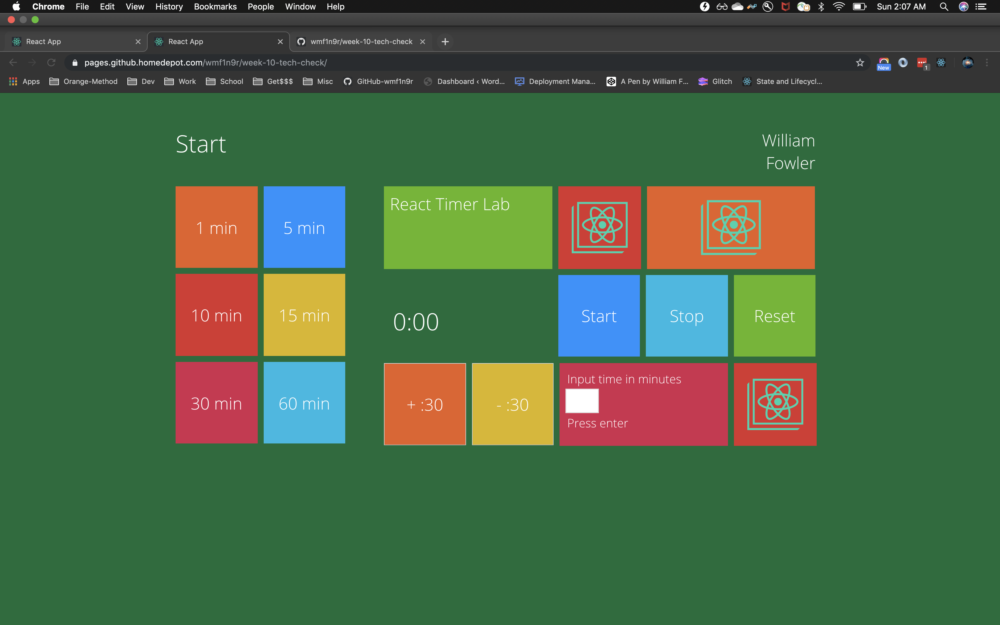

## Week 10 Tech Check - React Timer Lab

### Instructions: Write a countdown timer with the following required features listed below.

Use JavaScript’s setInterval and clearInterval for starting and stopping the internal countdown logic.

Use React’s componentDidMount and componentWillUnmount to start and stop the internal time.

### Label

Display the name of timer.

For example, 'Eggs', 'Bacon', etc. would be displayed as a header within the timer

hint: this label should be served as a prop

### Count Down Time

Display initial time to count down

Displayed as minutes and seconds, for example, 90 seconds would show as 1:30

This initial time should be used to initialize the state on render

### Start/Stop Toggle Button

One button used to start and pause the timer

Pause button should be shown while the timer is actively counting down

The pause button should toggle to a Start button when timer is not running

### Reset Button

A reset button sets the timer to it’s initial time.

### Increment/Decrement Buttons

Two buttons, one to increase and the other to decrease the timer value

increment button adds 30 seconds to the remaining time

decrement button subtracts 30 seconds from the remaining time

The timer should stop at 0 and not go negative

## 8.1. Bonus (not required)

### User Inputs

Provide inputs for custom modifications to the timer

An input field for the user to change the name of the timer

An input field for the user to change the remaining time

### Styles

Timer and user inputs should have custom styling. Some suggestions include:

Timer and user inputs are centered

Timer and user inputs are responsive and share equal width on the page

Custom Buttons

Timer changes color once it reaches 0

Custom Font

## Installation
npx create-react-app react-timer-app

npm start
